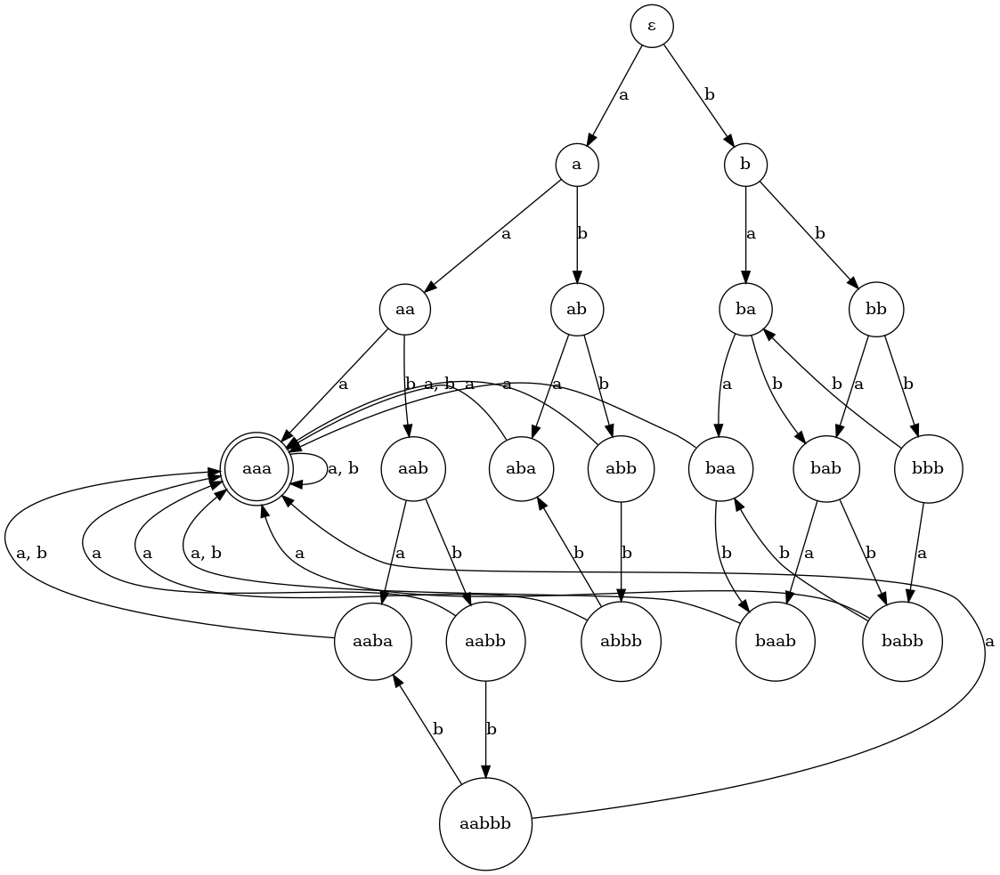

# Арбузов Тимофей ИУ9-52Б, вариант 1

---

\[
T \;=\;\left\{
\begin{aligned}
&\mathtt{abbaba}\ \to\ \mathtt{aabbbaa}\\
&\mathtt{aaa}\ \to\ \mathtt{abab}\\
&\mathtt{abba}\ \to\ \mathtt{baaab}\\
&\mathtt{bbbb}\ \to\ \mathtt{ba}
\end{aligned}
\right.
\qquad\text{алфавит } \Sigma=\{a,b\}
\]

---

## 1. Завершимость

Найдем конкретную бесконечную цепочку. Возьмём
\[
w_0=\mathtt{aaababa}.
\]
Тогда возможна цепочка:
\[
\begin{aligned}
\mathtt{aaababa} &\to\ \mathtt{ababbaba}\\
\mathtt{ababbaba}\ &\to\ \mathtt{abbaaabba}\\
\mathtt{abbaaabba}\ &\to\ \mathtt{baaabaabba}\\
\mathtt{baaabaaabba}\ &\to\ \mathtt{baaababaaab}\\
\end{aligned}
\]
В \(\mathtt{baaababaaab}\) снова встречается подслово \(\mathtt{aaababa}\). Повторяя ту же схему на новом вхождении, получаем бесконечную последовательность переписываний.

\[
\boxed{\text{T незавершаема}}
\]

---

## 2. Классы эквивалентности по SRS

Правила переписывания используем в обе стороны.

Обратим внимание на слова \(\mathbf{aaa}\) и \(\mathbf{aaaa}\).
Построим цепочки преобразований:

\[
\begin{aligned}
\mathtt{aaa} \leftrightarrow \mathtt{abab}\\
\mathtt{abab} \leftrightarrow \mathtt{ab^5}\\
\mathtt{ab^5} \leftrightarrow \mathtt{abba}\\
\mathtt{abba} \leftrightarrow \mathtt{baaab}\\
\mathtt{baaab} \leftrightarrow \mathtt{bababb}\\
\mathtt{bababb} \leftrightarrow \mathtt{b^{10}}\\
\mathtt{b^{10}} \leftrightarrow \mathtt{b^7a}\\
\mathtt{b^7a} \leftrightarrow \mathtt{b^4aa}\\
\mathtt{b^4aa} \leftrightarrow \mathtt{baaa}.
\end{aligned}
\]

\[
\begin{aligned}
\mathtt{aaaa} \leftrightarrow \mathtt{ababa}\\
\mathtt{ababa} \leftrightarrow \mathtt{ab^5a}\\
\mathtt{ab^5a} \leftrightarrow \mathtt{abbaa}\\
\mathtt{abbaa} \leftrightarrow \mathtt{baaaba}\\
\mathtt{baaaba} \leftrightarrow \mathtt{bababba}\\
\mathtt{bababba} \leftrightarrow \mathtt{b^{13}}\\
\mathtt{b^{13}} \leftrightarrow \mathtt{b^3aaa}\\
\mathtt{b^3aaa} \leftrightarrow \mathtt{b^2aaa}\\
\mathtt{b^2aaa} \leftrightarrow \mathtt{baaa}\\
\mathtt{baaa} \leftrightarrow \mathtt{aaa}
\end{aligned}
\]

Таким образом получаем
\[
\boxed{\mathtt{aaa} \leftrightarrow \mathtt{baaa}}
\qquad\text{и}\qquad
\boxed{\mathtt{aaa} \leftrightarrow \mathtt{aaaa}}.
\]

Заметим, что если первая буква строке \(b\), то, благодаря преобразованию \(ba\) <-> \(b^4\) вся строка приводится к виду \(b^n\). (1)

Опираясь на вышеприведенные цепочки и замечание (1), достаточно рассмотреть два вида слов:

1. Слова, где \(b\) никак не переместить на первую позицию;
2. Слова, состоящие только из \(b\).

## 2.1 Слова, начинающиеся с \(a\)

Найдем все слова, которые нельзя привести к слову, начинающемуся с \(b\). Нам надо чтобы не было подряд трех букв \(a\). Пусть мы нашли все слова длины \(k\), которые нам подходят, тогда при поиске слов длины \(k+1\) будем к предыдущим словам приписывать в начало букву \(a\).
Итого, список слов без \(b\) на первой позиции, неприводимых к таким:
\[
\boxed{
a, aa, ab, aba, aab, abb, aaba, aabb, abbb, aabbb
}
\]

Остальные слова будут либо нам не подходить, либо приводиться к одному из этих.

## 2.2 \(b^n\)

Рассматриваем преобразования для различных \(n\):
\(b\), \(b^2\), \(b^3\) - неприводимы,
\[
\begin{aligned}
\mathtt{b^4} \leftrightarrow \mathtt{ba}\\
\mathtt{b^5} \leftrightarrow \mathtt{bab}\\
\mathtt{b^6} \leftrightarrow \mathtt{babb}\\
\mathtt{b^7} \leftrightarrow \mathtt{b^4a} \leftrightarrow \mathtt{baa}\\
\mathtt{b^8} \leftrightarrow \mathtt{baab}\\
\mathtt{b^9} \leftrightarrow \mathtt{babab} \leftrightarrow \mathtt{baaa} \leftrightarrow \mathtt{aaa}\\
\mathtt{b^{10}} \leftrightarrow \mathtt{baaa} \leftrightarrow \mathtt{aaa}.
\end{aligned}
\]

И так далее, т. е. при \(n\) > 8 имеем
\[
\boxed{b^n \leftrightarrow aaa}.
\]

Это и будут наши классы эквивалентности для такого случая.

Итого, получаем следующий набор из 20-ти классов эквивалентности:
\[
\boxed{
\epsilon, a, aa, ab, aab, aba, abb, aaba, aabb, abbb, aabbb, 
b, bb, bbb, ba, bab, babb, baa, baab, aaa
}
\]

Построим для них детерменированный конечный автомат:

---

## 3. Локальная конфлюэнтность

Самоперекрытие правила \(\mathtt{aaa}\to\mathtt{abab}\) на слове \(\mathtt{aaaa}\):
\[
\mathtt{aaaa}\to\mathtt{ababa},\qquad
\mathtt{aaaa}\to\mathtt{aabab}.
\]
Оба результата — нормальные формы относительно T и различны. Критическая пара не замыкается.

\[
\boxed{\text{T не локально конфлюэнтна (и не конфлюэнтна)}}
\]

---

# 4. Пополнение по Кнуту–Бендиксу

Берём фундированный порядок short-lex (сравниваем сначала по длине, затем лексикографически при \(a<b\)). 
Получаем завершаемую систему
\[
T' \;=\;\left\{
\begin{aligned}
&\mathtt{aabbbaa}\to\mathtt{abbaba}\\
&\mathtt{abab}\to\mathtt{aaa}\\
&\mathtt{baaab}\to\mathtt{abba}\\
&\mathtt{bbbb}\to\mathtt{ba}
\end{aligned}
\right.
\]
Каждое правило строго уменьшает длину в short-lex, следовательно T' завершаема.

Для завершаемых TRS конфлюэнтность \(\Longleftrightarrow\) локальная конфлюэнтность. Значит достаточно **замкнуть все критические пары**. Вычленяем правила, опираясь на построенный автомат.

## Базовые правила

- **(R1)** \(\mathtt{abab}\to\mathtt{aaa}\)
- **(R2)** \(\mathtt{bbbb}\to\mathtt{ba}\)

## Замыкание перекрытий на блоках \(b\)

- **(R3)** \( \mathtt{bba} \to \mathtt{bab} \)  
  (замыкает самоперекрытие \(\mathtt{bbbb}\) на \(\mathtt{bbbbb}\): \( \mathtt{bab}\) vs \(\mathtt{bba}\))
- **(R4)** \( \mathtt{babbb} \to \mathtt{baa} \)  
  (замыкает пик на \(\mathtt{bbbba}\): \( \mathtt{bbbba}\to\mathtt{baa}\) и \(\mathtt{bbbba}\to\mathtt{babbb}\))
- **(R5)** \( \mathtt{baba}\to\mathtt{baab}\)  
  (замыкает пик на \(\mathtt{babbbb}\): \(\mathtt{babbbb}\to\mathtt{baab}\) и \(\mathtt{babbbb}\to\mathtt{baba}\))

## Правила, приводящие в \(\mathtt{aaa}\)

- **(R6)** \(\mathtt{baaa}\to\mathtt{aaa}\)
- **(R7)** \(\mathtt{aaaa}\to\mathtt{aaa}\)
- **(R8)** \(\mathtt{abaa}\to\mathtt{aaa}\)
- **(R9)** \(\mathtt{aaab}\to\mathtt{aaa}\)
- **(R10)** \(\mathtt{baaba}\to\mathtt{aaa}\)
- **(R11)** \(\mathtt{baabb}\to\mathtt{aaa}\)

Очевидно, что итоговая система из этих 11-ти правил остаётся терминирующей. Значит она локально конфлюэнтна, а так как она терминирует — она конфлюэнтна.

\[
\boxed{\ \text{SRS пополняема по Кнуту–Бендиксу}\ }
\]

---

# 5. Инварианты
Обозначим \(a(w)\) и \(b(w)\) — количества букв \(a\) и \(b\) в слове \(w\).

## 1. Если в слове \(w\) есть хотя бы одна \(a\), то ни в \(T'\), ни в минимальной системе нельзя получить слово без \(a\).

## 2. Из непустого слова нельзя получить пустое: \(\epsilon\) недостижимо.

## 3. \(a+2\,b\) не растёт
Введём
\[
\varphi(w)=a(w)+2\,b(w).
\]
Для любого шага переписывания \(w\to w'\) в \(T'\) и в минимальной системе справедливо
\[
\varphi(w')\le \varphi(w).
\]